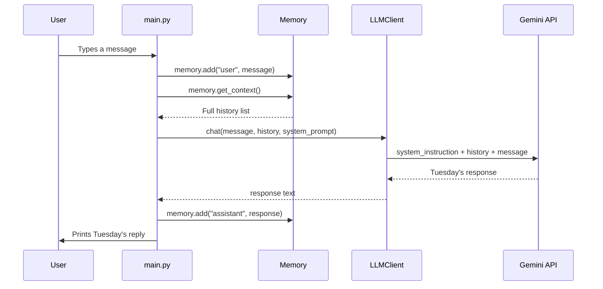

# Day 3 — Giving Tuesday a Memory 🧠

## The Problem Right Now

Every time you send Tuesday a message, the `chat()` function sends **only that single message** to the Gemini API. The API has no idea what you said 10 seconds ago. It's like talking to someone who gets their memory wiped after every sentence — of course Tuesday sounds like a generic Google AI!

## How Short-Term Memory Works (The Doctor Analogy)

Imagine you visit a doctor who has **no chart** for you:

| Visit | What Happens |
|-------|-------------|
| Visit 1 | "Hi, I have a headache." → Doctor prescribes aspirin. |
| Visit 2 | "It's still hurting." → Doctor says "What's hurting? Who are you?" |

That's Tuesday right now — **no chart, no memory**.

Now imagine the doctor keeps a **running transcript** on a clipboard:

| Visit | Clipboard Contents Sent to Doctor |
|-------|----------------------------------|
| Visit 1 | `[Patient: "I have a headache."]` → Doctor prescribes aspirin and writes it down. |
| Visit 2 | `[Patient: "I have a headache.", Doctor: "Take aspirin.", Patient: "It's still hurting."]` → Doctor says "Let's try something stronger." |

**That clipboard is your `Memory` class.** Every time we call the API, we hand it the *entire transcript so far*. The LLM reads the whole thing, which is how it "remembers."

## What the System Prompt Does

The system prompt is like a **name badge + rulebook** pinned to the doctor's coat:

> *"You are Dr. Tuesday. You are concise. You confirm before deleting files."*

No matter how long the conversation gets, those instructions stay front and center. The Gemini API has a dedicated slot for this — it's **not** mixed in with the chat messages. It sits above them, as a permanent instruction.

## The Flow After Our Changes

## Files We're Changing

| File | What Changes |
|------|-------------|
| [llm_client.py](file:///c:/My_Projects/My_Projects/Tuesday/brain/llm_client.py) | `chat()` and provider methods now accept `history` + `system_prompt` |
| [main.py](file:///c:/My_Projects/My_Projects/Tuesday/main.py) | Loads system prompt, creates Memory, wires the loop |
